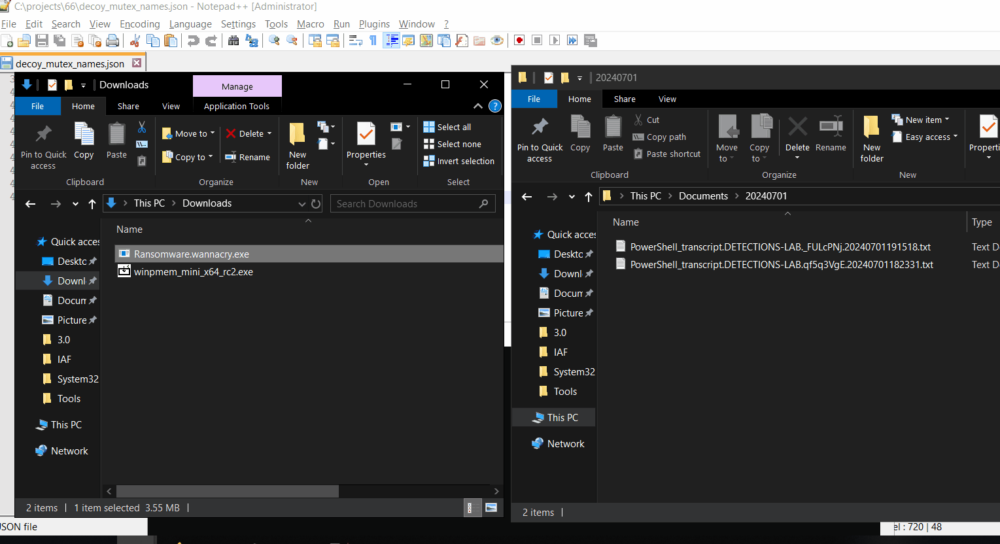
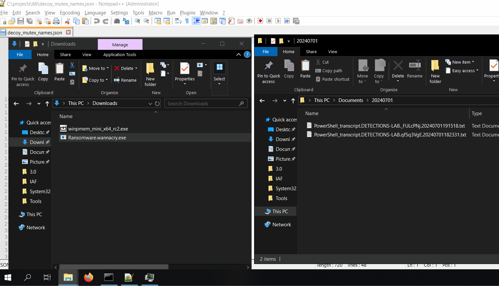

# Decoy-Mutex

A Windows tool for creating decoy mutexes (Fake Infection Markers) associated with ransomware simulations. Ransomware checks for the presence of its related mutex to determine whether the system is already infected. It doesn’t infect the system if it locates the mutex.


The tool parses the JSON file and extract Mutex information from it and create using [CreateMutexA](https://learn.microsoft.com/en-us/windows/win32/api/synchapi/nf-synchapi-createmutexa) function. The JSON structure is shown as follows: 

```json
[
	{
		"ransomware":"WannaCry",
		"mutex":[
			"MsWinZonesCacheCounterMutexA",
			"MsWinZonesCacheCounterMutexA0",
			"SM0:5520:168:WilStaging_02"
		]
	},
	{
		"ransomware":"Conti",
		"mutex":[
			"kjsidugidf99439", 
			"hsfjuukjzloqu28oajh7271", 
			"kasKDJSAFJauisiudUASIIQWUA82"
		]
	},
	{
		"ransomware":"BlackBasta",
		"mutex":[
			"dsajdhas.0"
		]
	},
	{
		"ransomware":"Babuk_v3",
		"mutex":[
			"babuk_v3"
		]
	},
	{
		"ransomware":"HelloKitty",
		"mutex":[
			"HELLOKITTYMutex"
		]
	},
	{
		"ransomware":"FFDroider",
		"mutex":[	
			"37238328-1324242-5456786-8fdff0-67547552436675	"
		]
	},
	{
		"ransomware":"RemcosRAT",
		"mutex":[
			"Remcos_Mutex_Inj"
		]
	}
]
```
## Scenario Before Deception

The GIF below shows the normal scenario where a Ransomware is executed on the system, it checks for presence of mutex infection marker and could not locate it. In this case, system gets infected. 




## Scenario After Deception

The GIF below shows the normal scenario where a Ransomware is executed on the system, it checks for presence of mutex infection marker and could not locate it. In this case, system gets infected. 


